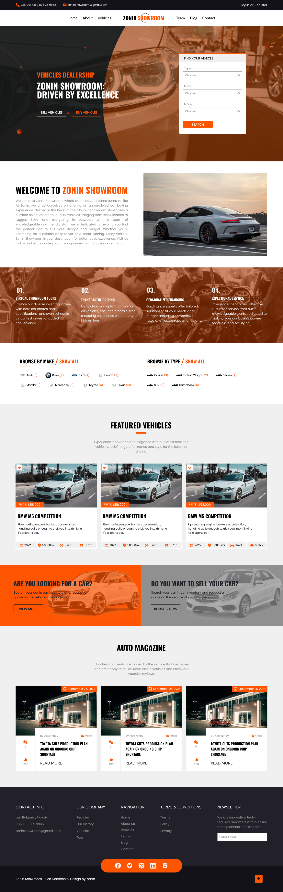

# :car: Zonin Showroom - Front-end

### Zonin Showroom! This repository contains the front-end codebase for our online platform where customers can explore our car catalog, read our blog, and learn more about automotive niche.

Our Car Dealership aims to provide a visually appealing and intuitive user interface, enhancing the browsing experience for our customers. Please note that this project is solely focused on the front end, providing the layout, design, and interactivity of the website. The back-end functionalities such as user authentication, database management, and server operations are not included, but will be developed in the future to complement the front-end features.

## :art: Design
[Figma Public File](https://www.figma.com/community/file/1368623059742207486/zonin-showroom)

#### Landing Page:
 

## :hammer_and_pick: Main Technologies

- `React`
- `Context API`
- `CSS Modules`
- `React-icons`
- `Vite`
- `Figma`

## :memo: Process

As someone deeply involved in the car niche, I've recognized the need for a comprehensive online platform where individuals can easily list their cars for sale and where potential buyers can browse through a diverse range of options. My goal in developing this website is to create a space where users can seamlessly add their car advertisements and communicate between each other, providing detailed information and images to attract potential buyers.

## :boom: Features

- #### Responsive Design

## :books: What I Learned

## :thought_balloon: How can it be improved and future features

## :rotating_light: Running the Project

To run the project in your local environment, follow these steps:

1. Clone the repository to your local machine.
2. Run `npm install` or `yarn` in the project directory to install the required dependencies.
3. Run `npm run dev` or `yarn run dev` to get the project started.
4. Open [http://localhost:5173](http://localhost:5173) (or the address shown in your console) in your web browser to view the app.

<!--  -->
<!-- Home -->